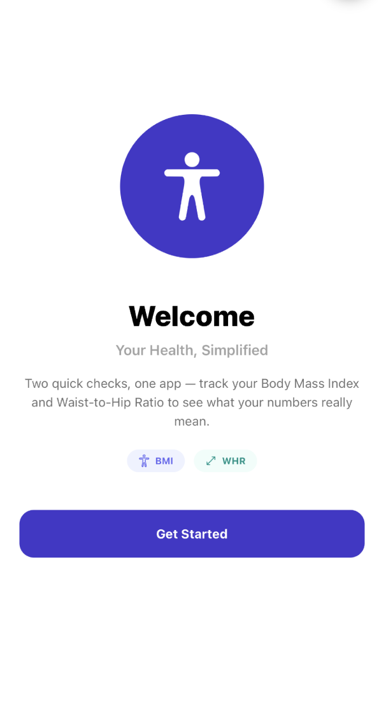
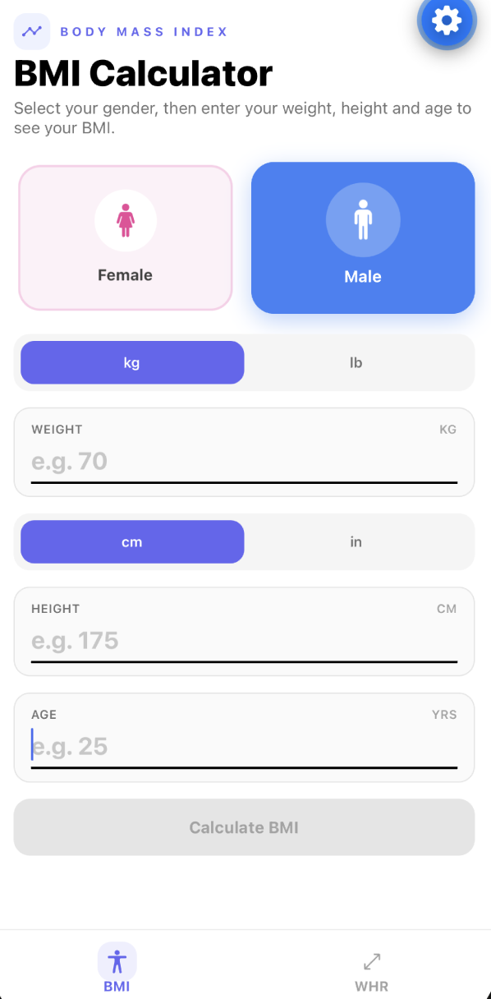
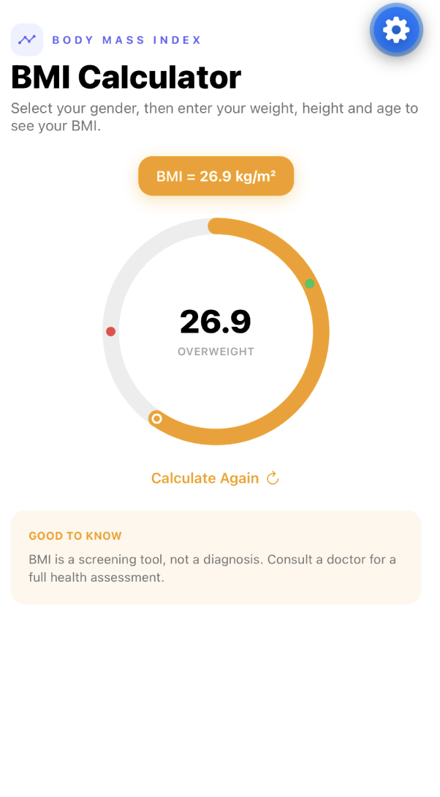
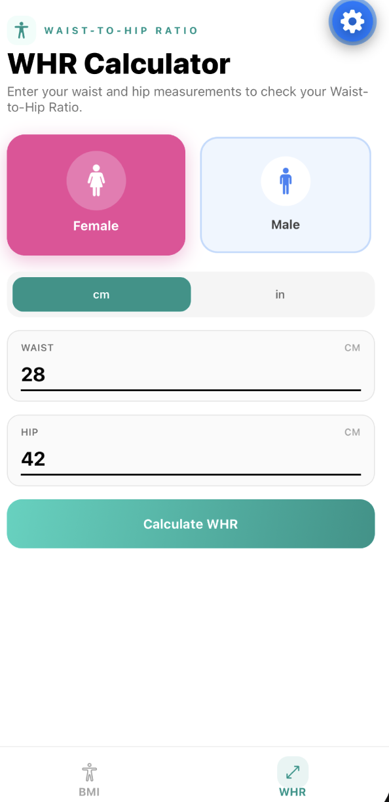
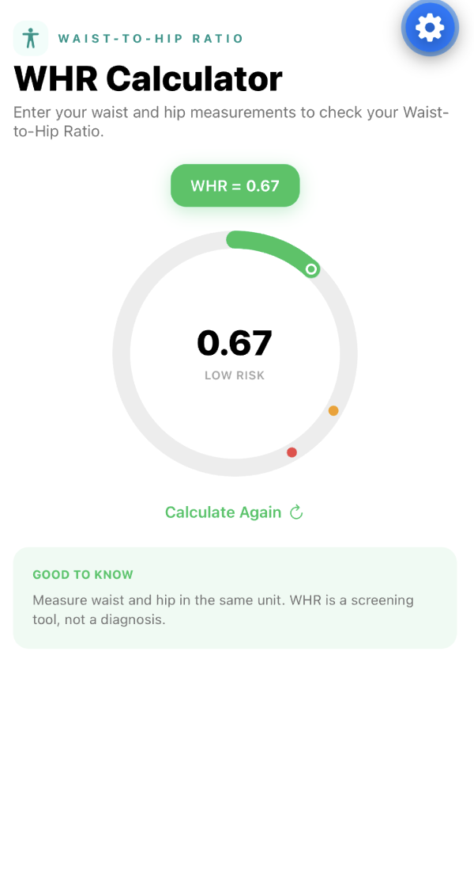

# BMI and WHR Calculator

A mobile app built with Expo and React Native for tracking two common health metrics — **Body Mass Index (BMI)** and **Waist-to-Hip Ratio (WHR)** — with instant, on-device calculations and no account required.

## Screenshots



| BMI Calculator | BMI Result |
| :---: | :---: |
|  |  |

| WHR Calculator | WHR Result |
| :---: | :---: |
|  |  |

## Features

- **BMI Calculator** — Enter your height and weight to get your BMI and a category (Underweight, Normal, Overweight, Obese), shown on a circular gauge.
- **Waist-to-Hip Ratio Calculator** — Enter waist and hip measurements, with a gender toggle (male/female) to get a risk category (Low, Moderate, High) using gender-specific thresholds.
- **Unit flexibility** — Switch between metric and imperial units: kilograms/pounds for weight, centimeters/inches for height and measurements.
- **Persisted inputs** — Your last-entered values are saved locally with `AsyncStorage`, so they're there the next time you open the app.
- **Onboarding screen** — A short animated welcome flow shown on first launch.
- **Tab navigation** — Quick switching between the BMI and WHR screens via a bottom tab bar.

## Tech Stack

- [Expo](https://docs.expo.dev/versions/v57.0.0/) (SDK 57) / React Native 0.86
- [React Navigation](https://reactnavigation.org/) (bottom tabs)
- [NativeWind](https://www.nativewind.dev/) / Tailwind CSS for styling
- `@react-native-async-storage/async-storage` for local persistence
- `react-native-svg` for the circular gauge visualization
- `expo-linear-gradient` and `react-native-reanimated` for UI animation

## Getting Started

### Prerequisites

- [Node.js](https://nodejs.org/) (LTS recommended)
- The [Expo Go](https://expo.dev/go) app on your phone, or an iOS/Android simulator

### Installation

```bash
git clone <repository-url>
cd bmi-calculator
npm install
```

### Running the app

```bash
npm start        # Start the Expo dev server
npm run ios      # Run in the iOS simulator
npm run android  # Run in the Android emulator
npm run web      # Run in a web browser
```

Scan the QR code shown in the terminal with the Expo Go app to run it on a physical device.

## Project Structure

```
.
├── App.js                    # Root component: onboarding flow + tab navigator
├── index.js                  # Expo entry point
├── src/
│   ├── components/           # Reusable UI (gauge, toggles, inputs, buttons, result card)
│   ├── screens/               # BMIScreen, WHRScreen, OnboardingScreen
│   └── utils/                 # BMI/WHR math, unit conversion, persisted state hook
├── app.json                  # Expo app configuration
└── tailwind.config.js        # NativeWind/Tailwind configuration
```

## Calculations

- **BMI** = weight (kg) / height (m)²
- **WHR** = waist measurement / hip measurement

Category thresholds live in `src/utils/bmi.js` and `src/utils/whr.js`.

## Disclaimer

This app is for general informational purposes only and is not a substitute for professional medical advice, diagnosis, or treatment.
